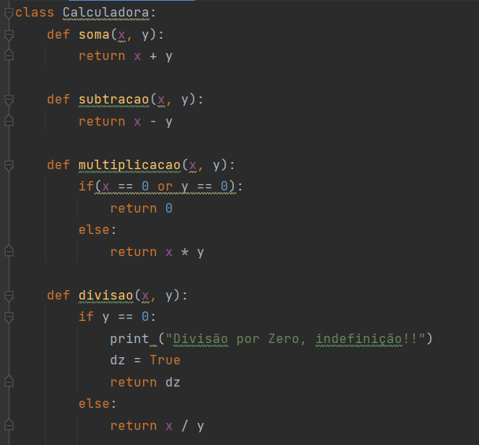
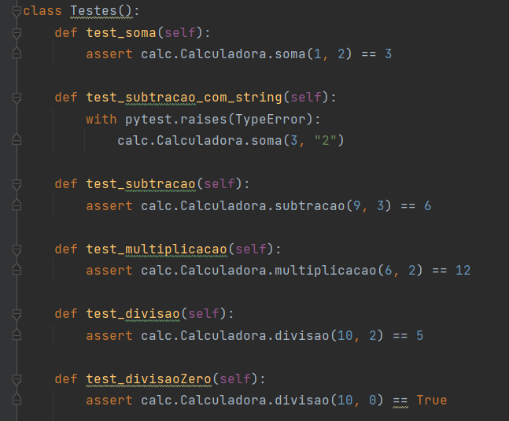

<h1 align="center"> Hello, world Dev!💻 </h1>

## Menu

- [O Projeto](#sobre-o-projeto)
- [Equipe](#equipe)
- [Instalação](#instalação-das-ferramentas-necessárias-%EF%B8%8F)
   - [Pré-requisitos](#pré---requisitos-)
   - [Windows](#-windows-so-)
   - [Linux](#-linux-so)
   - [MacOS](#-macos)
- [Passo a passo](#bora-pro-passo-a-passo-)
   - [Clonando o projeto](#clonando-o-projeto-)
   - [Testes](#testes-%EF%B8%8F%EF%B8%8F)
- [Arquivos](#arquivos-open_file_folder)
- [Calculadora](#calculadora)
- [Testes](#testes)


## Sobre o Projeto
Projeto desenvolvido para o seminário da matéria Engenharia de software(C214) ministrada pelo professor Chris Lima no primeiro semestre de 2022.

Na realização deste seminário foi utilizada a ferramenta **Pytest**, visando a criação de testes unitários, e para isso foi criada uma calculadora em python.

## Equipe:
    * 👧 Luiza Monroe
    * 👦 Alvaro Breno 


### Instalação das Ferramentas necessárias 💻⚙️
Para saber mais sobre a ferramenta <a href="https://pypi.org/project/pip/"> Pytest </a>, você pode acessar a documentação e poder esclarecer quaisquer duvidas que surgirem. Mas os step principais para instalação a seguir:

### Pré - Requisitos 🎯
Para instalar o Pytest é preciso ter também em sua máquina o <a href="https://pypi.org/project/pip/">PIP</a>, gerenciador de pacotes do Python.<br>
Normalmente, o PIP é instalado automaticamente se você:
- Está usando Python baixado de <a href="https://www.python.org/">python.org</a>
⁉️ Vale ressaltar que, se você estiver usando IDE's como o <a href="https://www.jetbrains.com/pt-br/pycharm/">PyCharm</a>, esta IDE já possue o PIP integrado e também uma fácil instalação do <a href="https://www.jetbrains.com/help/pycharm/pytest.html">Pytest</a>, direto em suas configurações de projeto. O <a href ="https://code.visualstudio.com/docs/python/testing">VSCode</a> também tem sua extensão com o Python e seu guia de instalação. 

# <p>💿 Windows S.O </p>
<p>⚠️Antes de tudo, você pode usar o CMD do Windows ou até mesmo o <a href="https://dicasdeprogramacao.com.br/como-instalar-o-git-no-windows/">Git</a> Bash para isso ⚠️</p>

<p>Step 1: Rode o seguinte comando para baixar o arquivo "get-pip.py": </p>

```bash
curl https://bootstrap.pypa.io/get-pip.py -o get-pip.py
```

<p>Step 2: Instalando PIP no windows: </p>

```bash
python(ou py) get-pip.py
```

<p>Step 3: Adicione PIP nas suas <a href="https://www.noticiastecnicas.com/variaveis-de-ambiente-do-sistema-e-do-usuario-no-windows-explicadas/">variáveis de ambiente</a> do Windows, para poder rodar o comando de qualquer lugar. </p>

### Versão e atualização
- Para verificar se instalou corretamente e saber sua versão, rode o seguinte comando:
```bash
pip --version
```

- Para atualizar sua versão do PIP, rode o seguinte comando:
```bash
python -m pip install --upgrade pip
```

### Instalando o Pytest
- 1º Com um simples comando você já instala o Pytest:
```bash
pip install -U pytest
```

- 2º Para saber a versão do Pytest, também é simples:
```bash
pytest --version
```

# 💿 Linux S.O 
Você pode seguir o step do <a href ="https://python.org.br/instalacao-linux/">python.org </a> para instalação do Python em Linux

# Pytest
Step 1: 
```bash
sudo apt-get update
```

Step 2:
```bash
sudo apt-get install python-pytest
```

# 💿 MacOS
Você pode seguir o step do <a href ="https://python.org.br/instalacao-mac/">python.org </a> para instalação do Python em MacOS

# Pytest
Os passos a serem seguidos para os <a href="https://www.geeksforgeeks.org/how-to-install-pytest-for-python3-on-macos/"> testes </a>

## <p>Bora pro passo a passo! 👇</p>

### Clonando o projeto 🔀
Agora é hora de baixar o projeto e poder testar um pouco dessa ferramenta de testes unitários.

- Com o terminal ainda aberto, navegue até a pasta onde deseja salvar o projeto e cole o seguinte comando:
```bash
git clone https://github.com/luizamonroe/Seminario-c214-PYTEST
```
<p> **Pronto, tudo configurado! Agora é só escolher o seu IDE que preferir.** </p>

### Testes ☑️✖️
## Para realização dos testes, 3 comandos podem ser feitos:
- 1º (Rodar todos os arquivos de teste):
```bash
pytest
```

- 2º (Rodar um arquivo de teste específico):
```bash
pytest nome_do_arquivo.py
```

- 3º (Rodar os testes, até encontrar um erro):
```bash
pytest -x ou pytest nome_do_arquivo.py -x
```

## Arquivos :open_file_folder:
<!--ts-->
  * :file_folder: calculadora
    * :file_folder: test
        * :page_facing_up: __init__.py
        * :page_facing_up: [test_testes.py](#testes)
     * :page_facing_up: __init__.py
     * :page_facing_up: [calculadora.py](#calculadora)
<!--te-->

## Calculadora

## Testes

